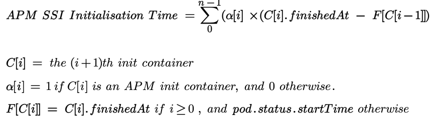

# Introduction

This repository is helpful to evaluate the following formula for calculating pod initialisation duration for APM SSI containers in datadog agent applications:



# Steps to test

1. Create a minikube cluster
```
minikube start --nodes 1
```
2. Create and activate a virtual environment
```
python3 -m venv my-venv && source my-venv/bin/activate
```
3. Install required modules
```
pip install -r requirements.txt
```
4. Run analyse.py script
```
python3 analyse.py
```

When running the analyse.py script, the following will happen:

A sample pod is created (can be found in sample-pod.yaml).

This pod contains 3 init containers, each init container pulls a different image with Always Pull Image Policy.

Each init container sleeps for 7 seconds before terminating.

The analyser will parse the output of pod describe output to extract the duration of the image pull durations of each container.

It will also parse the status section of the get pod output to extract the `startedAt` and `finishedAt` field of each init container.

It will finally output the total duration of each container (including image pull time) as reported by the kubelet and as calculated by the proposed formula.

It will also show the relative error.

Note: It is completely normal to get slightly different results on each run.

# Sample Output

Here is a sample output of the results:

```
python3 analyse.py                            
pod "sample-pod" deleted
pod/sample-pod created
waiting for pod to become in Running state...
waiting for pod to become in Running state...
waiting for pod to become in Running state...
waiting for pod to become in Running state...
waiting for pod to become in Running state...
waiting for pod to become in Running state...
waiting for pod to become in Running state...
Parsing events...
==== Image Pull Times =====
nginx   1.024160083s
ruby   899.58275ms
python   960.193459ms

Parsing InitContainerStatuses ...
Pod Start Time: 2024-11-19T15:29:37Z

+------------------+----------------------+----------------------+--------------------+--------------------------+----------------------------------------+--------------------+
|  Container Name  |      Start Time      |     Finish Time      | Duration (seconds) | Total Duration (seconds) | Total Duration Using Formula (seconds) | Relative Error (%) |
+------------------+----------------------+----------------------+--------------------+--------------------------+----------------------------------------+--------------------+
| init-container-1 | 2024-11-19T15:29:38Z | 2024-11-19T15:29:46Z |        8.0         |           10.0           |                  9.0                   |        10.0        |
| init-container-2 | 2024-11-19T15:29:47Z | 2024-11-19T15:29:54Z |        7.0         |           8.0            |                  8.0                   |        0.0         |
| init-container-3 | 2024-11-19T15:29:55Z | 2024-11-19T15:30:02Z |        7.0         |           8.0            |                  8.0                   |        0.0         |
+------------------+----------------------+----------------------+--------------------+--------------------------+----------------------------------------+--------------------+

Total Relative Error: 3.846 %
```

## Significance of each column

- **Start Time**: is the time at which the init container started running, which is typically after the image has been pulled. It is calculated from `pod.status.initContainerStatus[*].terminated.startedAt`.
- **Finish Time**: is the time at which the init container terminated successfully. It is calculated from `pod.status.initContainerStatus[*].terminated.finishedAt`.
- **Duration**: is calculated as `Finish Time - Start Time`. This is the duration during which the init container was running, excluding the image pull duration.
- **Total Duration**: is the actual duration of the init container including the image pull duration. The image pull duration is obtained by parsing the `Events` section of the pod describe output. This serves as the reference for comparison as it is the closest to the real value. Durations in milliseconds are rounded up to the nearest second.
- **Total Duration Using Formula**: is the result of applying the formula mentioned in the introduction second.
- **Relative Error**: is calculated as `|Total Duration Using Formula  - Total Duration | x 100 / Total Duration`

Note that it is fine to have small relative errors, which can be due to rounding millisecond time up to the nearest second, or due to some random insignificant delays (for example, scheduling delay)
